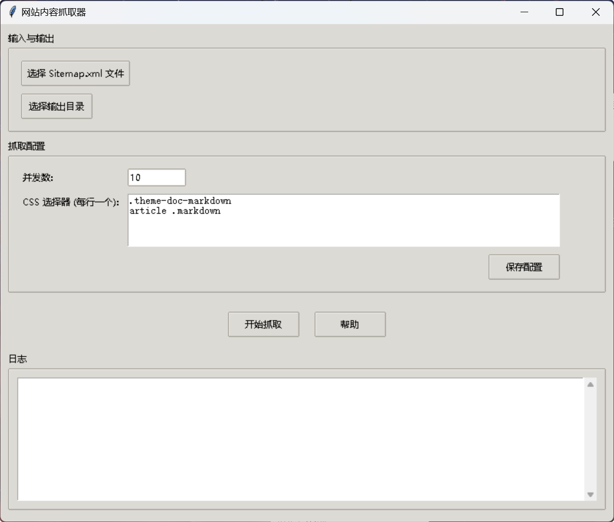

[**English Version**](./README.en.md)

# 网站内容抓取器 (Python GUI版)

这是一个基于 Python 和 Tkinter 的图形界面工具，用于从指定网站的 `sitemap.xml` 文件中提取所有链接，抓取每个页面的主要内容，并最终将每个页面的内容保存为带有元数据的独立 Markdown 文件。



## ✨ 功能特性

- **图形用户界面 (GUI)**: 基于 Tkinter 构建，操作直观友好。
- **Sitemap 解析**: 自动读取并解析指定的 `sitemap.xml` 文件。
- **并发抓取**: 使用多线程并发执行抓取任务，以提高效率。
- **User-Agent 轮换**: 内置 User-Agent 池，在每次请求时随机选择，降低被屏蔽风险。
- **代理禁用**: 自动禁用系统级的 HTTP/HTTPS 代理，确保网络请求的直接性。
- **结构化输出**:
    - 每次运行都会在指定目录内创建一个以当前时间戳命名的独立文件夹。
    - 每个成功抓取的页面都会被保存为一个 `.md` 文件，并保持原始 URL 的路径结构。
- **元数据添加**: 自动在每个生成的 Markdown 文件头部添加 YAML Front Matter 格式的元数据。
- **跨平台打包**: 已配置好 PyInstaller，可轻松打包成单个可执行文件。

---

## 🚀 安装与设置

### 1. 前置要求

- 确保您的系统已安装 **Python 3.6** 或更高版本。

### 2. 安装依赖

建议在 Python 虚拟环境中进行操作，以避免与系统库冲突。

a. **创建并激活虚拟环境** (可选，但推荐)

```bash
# 创建虚拟环境 (例如，命名为 venv)
python -m venv venv

# 激活虚拟环境
# Windows
.\venv\Scripts\activate
# macOS / Linux
source venv/bin/activate
```

b. **安装所需库**

项目依赖已在 `requirements.txt` 中列出。运行以下命令进行安装：

```bash
pip install -r requirements.txt
```

---

## 🛠️ 如何使用

### 运行程序

完成安装后，只需在项目根目录下运行以下命令即可启动图形界面：

```bash
python main_gui.py
```

### GUI 操作指南

1.  **选择 Sitemap**: 点击“选择 Sitemap.xml 文件”按钮，找到并选择目标网站的 sitemap.xml 文件。
2.  **选择输出目录**: 点击“选择输出目录”按钮，选择一个用来保存抓取结果的文件夹。
3.  **配置参数**:
    - **并发数**: 根据您的网络情况调整，建议保持在 5-20 之间。
    - **CSS 选择器**: 在文本框中输入一个或多个CSS选择器，每行一个。程序会尝试提取所有匹配项。
    - **保存配置**: 修改配置后，可点击“保存配置”将其存为 `config.json` 中的默认值。
4.  **开始抓取**: 点击“开始抓取”按钮启动任务。
5.  **查看日志**: 下方的日志区域会实时显示抓取进度和结果。

---

## 📦 打包为可执行文件 (可选)

本项目已配置好 PyInstaller，您可以轻松地将其打包成一个独立的 `.exe` 文件 (在 Windows 上)。

1. **安装 PyInstaller** (如果尚未安装):
   ```bash
   pip install pyinstaller
   ```
2. **执行打包命令**:
   使用项目根目录下的 `.spec` 文件进行打包：
   ```bash
   pyinstaller crawler.spec
   ```

打包完成后，您可以在 `dist` 目录下找到名为 `文档内容抓取器.exe` 的文件。您可以将此文件连同 `config.json` 一起分发，在其他没有安装 Python 环境的电脑上也能运行。

---

## ⚠️ 局限性

当前版本的爬虫使用 `requests` 和 `BeautifulSoup` 库，这决定了它**只能抓取静态 HTML 页面的内容**。

对于大量使用 JavaScript 在客户端动态渲染内容的现代网站（例如基于 React, Vue, Docusaurus 的站点），此脚本可能无法提取到目标内容。

**未来改进方向**: 如果需要完整抓取所有页面，可以将抓取引擎替换为 **Playwright** 或 **Selenium**，它们可以模拟真实浏览器环境来执行 JavaScript。